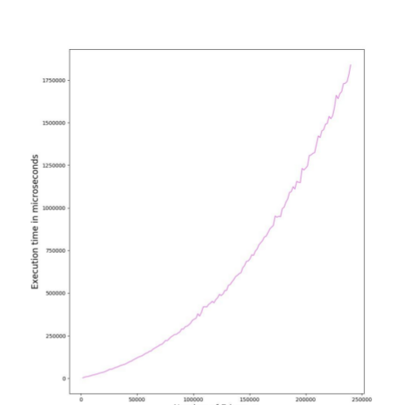

# Kruskal-Implementation-using-avl-and-VEB-trees
Study on avl and VEB trees on Kruskal algorithm

1 Introduction

    Comparison of performance of Kruskal’s Minimum Spanning Tree algorithm with its
    implementation through van Emde Boas Tree and AVL tree with Union Find. Kruskal’s
    Algorithm uses Union Find operation. Instead of sorting an array for extracting the next
    smallest edge, we are using van Emde Boas Tree and AVL tree for performing extract
    min operation.

1.1 Van Emde Boas Tree

    • Given a set S of elements such that the elements are taken from universe {0, 1 ....u-1}. 
    • Van Emde Boas tree (or vEB tree) supports insert(), delete, find(), successor() 
      and predecessor() operations in O(Log Log u) time, and max() and min() in O(1) time
    • A thing to note about the vEB trees is that the time taken by it to perform the above
      operations is independent of the elements which are actually present  
      in the tree. It depends on the universe size i.e ‘u’

1.2 AVL (ADELSON-VELSKY AND LANDIS) TREE
    
    • An AVL Tree is a self-balancing binary search tree. It was the first such data structure
      to be invented. AVL tree is a self-balancing Binary Search Tree (BST) where the
      difference between heights of left and right subtrees cannot be more than one for all
      nodes.
    • If the above is condition is violated after any operation then rebalancing is done to
      restore this property. Insertions and deletions may require the tree to be rebalanced
      by one or more tree rotations.
    • Most of the BST operations (e.g., search, max, min, insert, delete.. etc) take O(h) time
      where h is the height of the BST. The cost of these operations may become O(n) for a
      skewed Binary tree. If we make sure that height of the tree remains O(Logn) after every
      insertion and deletion, then we can guarantee an upper bound of O(Logn) for all these
      operations. The height of an AVL tree is always O(Logn) where n is the number of nodes
      in the tree.
    • So operations like Insertion, Deletion, Find(x), FindMin, FindMax all are carried out in a
      worst case time of O(log n).

2 Implementation
    
2.1 Kruskal algorithm

    Kruskal's algorithm is a minimum-spanning-tree algorithm which finds an edge of the
    least possible weight that connects any two trees in the forest. It is a greedy Algorithm.
    This means it finds a subset of the edges that forms a tree that includes every vertex,
    where the total weight of all the edges in the tree is minimized.     

2.2 Files 
    
    1) extras and inpwt5 are input files  having predefined edge weights between two edges 
    2) avl.h and vEBTree.h are files for creating respectives trees functions and defining them.
    3) vEBimp.cpp is created for understanding the working of vEBtree with the help of user input
    3) We can make user defined  file(eg f.txt) as well as can use  predefined input files for testing of code
    4) How to run
        g++ Kruskal.cpp
        
3 Results
    
    VEB Tree
   
    
    AVL Tree
   
    
4 Conclusion
   
    1) The weights lied between the range (1,65536], consequently we fixed the universe
       size of VEB tree to be 65536 .
    2) We can see that for the initial values, the AVL tree outperforms the VEB tree. The
       reason for this are the constants that are associated with the VEB tree, which has
     a fixed structure, unlike the dynamically changing AVL tree.
    3) For higher values, the VEB tree starts to outperform the AVL tree as the O(log logu)
       (u being universe size) factor of vEB tree becomes significantly smaller than the
       O(log n) (n being the number of edges in tree) of the AVL tree.
    4) The increase in performance is not very pronounced at the given range. However
       following the same trend, the performance of vEB tree should be considerably
       better than the AVL tree at higher number of edges and the weight range.

